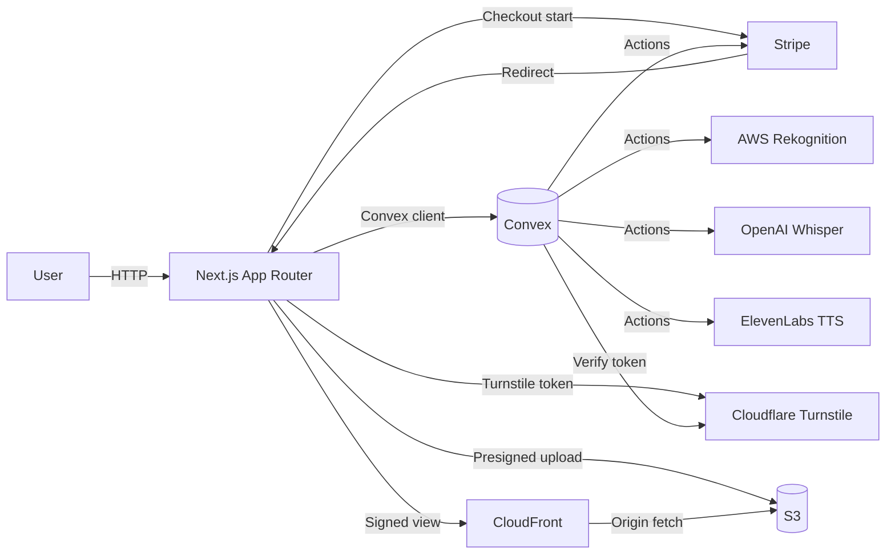
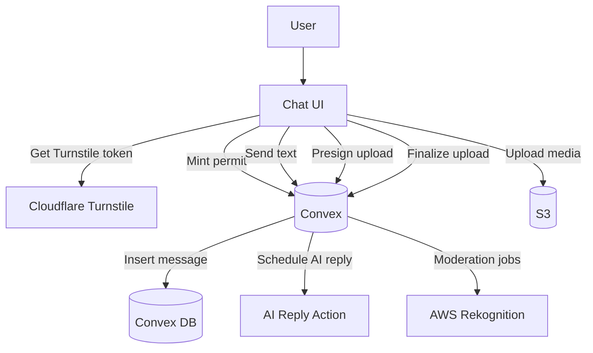

# Architecture Overview - NoviaChat

## Purpose
- This doc explains the important architecture pieces for an AI assistant.
- It focuses on how the app is structured and how major flows connect.
- It avoids listing every route; only core route groups are highlighted.
- It references key files so you can jump to implementation quickly.
- It is written in ASCII only on purpose.

## Read This First
- Framework: Next.js App Router with server and client components.
- Data and auth: Convex, using Convex Auth for password based login.
- Styling: Tailwind CSS only, with minimal custom utilities.
- File types: JavaScript and JSX only, no TypeScript.
- Primary domains: auth, profile, girls, chat, media, payments, admin, SEO.
- Runtime split: Next.js handles UI, Convex handles data and actions.
- Storage: AWS S3 for uploads, CloudFront for signed reads.
- AI: LLM responses, media selection, TTS, and moderation hooks.
- Payments: Stripe Checkout, Convex actions for verification.
- Security: Cloudflare Turnstile, Convex auth checks, signed media URLs.

## High Level Stack
- Next.js app router in `app/` for all pages and API routes.
- Convex backend in `convex/` for queries, mutations, and actions.
- Convex Auth in `convex/auth.js` and `convex/auth.config.js`.
- Convex server provider in `app/layout.js` and `app/providers.js`.
- Tailwind CSS in `app/globals.css` and PostCSS config in `postcss.config.mjs`.
- Stripe for checkout in `convex/payments_actions.js`.
- Cloudflare Turnstile in `app/layout.js` and `convex/turnstile.js`.
- AWS S3 for media uploads in `convex/s3.js`.
- CloudFront signed URLs in `convex/cdn.js`.
- AWS Rekognition for moderation in `convex/actions/analyzeImage.js`.
- ffmpeg static binary for video frame analysis in `convex/actions/analyzeVideo.js`.
- ElevenLabs TTS in `convex/s3.js` for AI audio replies.
- Luxon for time formatting in `convex/chat_actions.js`.
- Analytics: GA4 in `app/layout.js` with custom referral tracking.

## Compact System Diagram
- These diagrams are intentionally small and only show primary connections.
- Mermaid syntax is used for clarity and can be rendered in compatible viewers.

### Diagram: App and Services


### Diagram: Chat Send Path (Text and Media)


## Directory Map
- `app/` is the Next.js App Router root.
- `app/layout.js` defines the global HTML shell and providers.
- `app/providers.js` wires the Convex client provider.
- `app/globals.css` includes Tailwind and utility classes.
- `app/api/` holds Next.js route handlers.
- `app/(auth)/` holds sign-in and reset password pages.
- `app/chat/` holds chat list and conversation UI.
- `app/girls/` holds public girl listing and profile.
- `app/stories/` holds the full screen story viewer.
- `app/account/` holds the user profile and billing view.
- `app/plans/` holds the premium plans UI.
- `app/checkout/` holds the Stripe success flow.
- `app/admin/` holds admin UI and tools.
- `app/lib/` holds shared server utilities like plan fetchers.
- `components/` holds UI components used by pages.
- `components/chat/` holds chat composition and media utilities.
- `components/profile/` holds girl profile UI pieces.
- `components/admin/` holds admin upload widgets.
- `convex/` holds all data model, queries, mutations, and actions.
- `convex/schema.js` defines data tables and indexes.
- `convex/chat.js` defines chat queries and mutations.
- `convex/chat_actions.js` defines AI reply and typing logic.
- `convex/chat_home.js` defines the chat list and story rail data.
- `convex/payments.js` defines payment queries and internal helpers.
- `convex/payments_actions.js` defines Stripe actions.
- `convex/girls.js` defines girls, media, stories, likes.
- `convex/profile.js` defines profile logic and validation.
- `convex/users.js` exposes user info and role for admin gating.
- `convex/turnstile.js` defines security permits.
- `convex/s3.js` defines S3 uploads and TTS.
- `convex/cdn.js` defines CloudFront signed URLs.
- `convex/actions/` holds media analysis jobs.
- `public/` holds static images and icons.
- `next.config.mjs` defines headers and redirects.
- `middleware.js` implements auth gating and redirects.
- `s3-cloudfront-implementation.md` documents media pipeline.

## App Folder Layout (Overview)
- This is a high level tree of `app/` to show how it is organized.
- It omits most marketing and SEO pages to keep it compact.
- Use `rg --files app` if you need the full list.

```
app/
  (auth)/
    signin/
      page.js
    reset-password/
      page.js
  account/
    page.js
  admin/
    layout.js
    conversations/
      page.js
      [conversationId]/
        page.js
    girls/
      page.js
      new/
        page.js
      [id]/
        page.js
        gallery/
          page.js
        posts/
          page.js
        assets/
          page.js
        stories/
          page.js
  api/
    geo/
      route.js
  chat/
    page.js
    [conversationId]/
      page.js
  checkout/
    success/
      page.js
  girls/
    page.js
    GirlsClient.js
    [id]/
      page.js
    layout.js
  stories/
    [girlId]/
      page.js
  plans/
    page.js
    PlansClient.js
    layout.js
  lib/
    convex-public.js
    currency.js
    seo-content.js
  globals.css
  layout.js
  page.js
  providers.js
  robots.js
  sitemap.js
  ...other marketing and SEO pages omitted
```

## App Router Layout and Routing
- The root layout is `app/layout.js`.
- It loads `app/globals.css`.
- It adds Cloudflare Turnstile and GA4 scripts.
- It wraps the app with `ConvexAuthNextjsServerProvider`.
- It wraps children with `Providers` from `app/providers.js`.
- It includes `Navbar`, `SiteFooter`, and `BottomNav`.
- The page content renders inside `<main>` in the layout.
- The app uses App Router segments like `(auth)` for auth pages.
- Many SEO pages are implemented as static routes in `app/`.
- `app/sitemap.js` and `app/robots.js` generate SEO metadata.

### Important Route Groups (not exhaustive)
- `/` is the marketing landing page in `app/page.js`.
- `/signin` and `/reset-password` are in `app/(auth)/`.
- `/account` is the user profile and payments area in `app/account/page.js`.
- `/chat` is the chat inbox list in `app/chat/page.js`.
- `/chat/[conversationId]` is the chat thread UI.
- `/girls` is the public listing in `app/girls/page.js`.
- `/girls/[id]` is the public girl profile in `app/girls/[id]/page.js`.
- `/stories/[girlId]` is the full screen story viewer.
- `/plans` is the premium plan list in `app/plans/page.js`.
- `/checkout/success` is the post payment landing page.
- `/admin/*` is the admin console.
- `/api/geo` returns country headers for signup hints.
- Many SEO content pages live as static routes under `app/`.

## UI Shell and Navigation
- Global shell components live in `components/`.
- `components/Navbar.js` is the top nav with auth aware actions.
- `components/BottomNav.js` is the mobile bottom nav for key areas.
- `components/SiteFooter.js` is the shared footer.
- `components/StartChatButton.js` handles premium gating before chat.
- `components/AvatarWithStoryRing.js` shows story ring UI.
- `components/home/StoryAvatarButton.jsx` is used on the home hero.

## Styling and UI Conventions
- Styling is Tailwind CSS only.
- `app/globals.css` imports Tailwind and defines utility classes.
- Tailwind classes are used directly in JSX.
- No TypeScript files are used.
- Client components are marked with `"use client"`.
- Server components are default in the App Router.
- Use Next.js `metadata` exports for SEO.

## Middleware and Redirects
- `middleware.js` uses Convex Auth middleware for auth gating.
- It enforces redirect from `noviachat.com` to `www.noviachat.com`.
- It handles legacy URL redirects via a map.
- It returns 410 for a small set of gone paths.
- It redirects authed users away from auth pages.
- It redirects unauthenticated users away from protected pages.
- It treats `/dashboard` and `/account` as protected.
- It treats `/admin` as protected.
- It is configured to run on all non static routes.

## API Routes
- `app/api/geo/route.js` reads CDN headers and returns a country code.
- The response is used to guess user country on signup.
- `next.config.mjs` applies `X-Robots-Tag: noindex` to `/api/*`.

## Convex Overview
- Convex runs as the backend and data store.
- Queries are used for reactive reads in the UI.
- Mutations are used for writes.
- Actions are used for side effects and external APIs.
- Convex Auth integrates with Next.js via provider and middleware.
- The schema is defined in `convex/schema.js`.
- The HTTP auth routes are wired in `convex/http.js`.

## Convex Data Model
- The schema is defined in `convex/schema.js`.
- `authTables` from Convex Auth are included in the schema.
- Most domain data is stored in custom tables below.

### Table: profiles
- Field: `userId` is the Convex user id.
- Field: `role` is optional and set to `admin` for admins.
- Field: `username` is the public handle.
- Field: `usernameLower` is the lowercase handle.
- Field: `name` is the display name.
- Field: `age` is a number.
- Field: `country` is ISO 2 letter code.
- Field: `avatarKey` is the S3 key for avatar.
- Field: `premiumUntil` is a legacy premium timestamp.
- Field: `premiumActive` is the boolean premium flag.
- Field: `updatedAt` is the last update timestamp.
- Index: `by_userId` on `userId`.
- Index: `by_usernameLower` on `usernameLower`.
- Note: `premiumActive` is used for fast checks.
- Note: `premiumUntil` is still used for expiry logic.

### Table: girls
- Field: `name` is the display name.
- Field: `nameLower` is lowercase name for search.
- Field: `displayBio` is the public bio.
- Field: `bio` is internal admin notes.
- Field: `premiumOnly` gates chat access for premium users.
- Field: `age` is optional.
- Field: `priority` controls ordering in listings.
- Field: `username` is optional handle.
- Field: `usernameLower` is lowercase handle.
- Field: `avatarKey` is S3 key for avatar.
- Field: `backgroundKey` is S3 key for profile background.
- Field: `voiceId` is ElevenLabs voice id.
- Field: `personaPrompt` is the AI persona prompt.
- Field: `createdBy` is the admin creator id.
- Field: `createdAt` is the creation timestamp.
- Field: `updatedAt` is the last update timestamp.
- Field: `isActive` is the public visibility flag.
- Field: `counts` is a denormalized object for media counts.
- Index: `by_nameLower` on `nameLower`.
- Index: `by_active` on `isActive`.
- Index: `by_createdAt` on `createdAt`.
- Index: `by_usernameLower` on `usernameLower`.
- Index: `by_priority` on `priority`.
- Note: `counts` is updated when media is added or removed.

### Table: girl_media
- Field: `girlId` is the parent girl id.
- Field: `kind` is `image`, `video`, or `audio`.
- Field: `isGallery` marks gallery items.
- Field: `isPost` marks post items.
- Field: `isReplyAsset` marks AI reply assets.
- Field: `objectKey` is the S3 object key.
- Field: `text` is caption or description.
- Field: `likeCount` is a denormalized counter.
- Field: `canBeLiked` enables likes for gallery or posts.
- Field: `mature` marks adult content.
- Field: `premiumOnly` gates gallery items.
- Field: `location` is for post items.
- Field: `durationSec` is for audio or video.
- Field: `published` controls visibility.
- Field: `createdAt` is creation time.
- Field: `updatedAt` is update time.
- Index: `by_girl` on `girlId`.
- Index: `by_girl_gallery` on `girlId` and `isGallery`.
- Index: `by_girl_posts` on `girlId` and `isPost`.
- Index: `by_girl_assets` on `girlId` and `isReplyAsset`.
- Note: assets require `text` and `mature` set.
- Note: assets cannot be liked.

### Table: girl_stories
- Field: `girlId` is the parent girl id.
- Field: `kind` is `image`, `video`, or `text`.
- Field: `objectKey` is optional and used for media stories.
- Field: `text` is used for text stories.
- Field: `published` controls visibility.
- Field: `createdAt` is creation time.
- Index: `by_girl` on `girlId`.
- Index: `by_girl_published` on `girlId`, `published`, `createdAt`.
- Index: `by_published_createdAt` on `published`, `createdAt`.

### Table: likes
- Field: `userId` is the liker.
- Field: `girlId` is denormalized from media.
- Field: `mediaId` is the target media.
- Field: `surface` is `gallery` or `post`.
- Field: `createdAt` is creation time.
- Index: `by_user_media` on `userId`, `mediaId`.
- Index: `by_user_girl` on `userId`, `girlId`.
- Index: `by_media` on `mediaId`.

### Table: payments
- Field: `userId` is the buyer.
- Field: `sessionId` is the Stripe Checkout session id.
- Field: `paymentIntentId` is optional.
- Field: `productId` is Stripe product id.
- Field: `priceId` is Stripe price id.
- Field: `amountTotal` is the total in minor units.
- Field: `currency` is the currency code.
- Field: `durationDays` is access duration.
- Field: `features` is the plan feature list.
- Field: `paidAt` is the payment timestamp.
- Field: `expiresAt` is the premium expiry timestamp.
- Field: `status` is `paid`.
- Field: `snapshot` is a JSON snapshot.
- Field: `createdAt` is record creation time.
- Index: `by_user` on `userId`, `createdAt`.
- Index: `by_sessionId` on `sessionId`.

### Table: payments_cache
- Field: `key` is cache key.
- Field: `json` is cached data.
- Field: `refreshedAt` is cache timestamp.
- Index: `by_key` on `key`.

### Table: conversations
- Field: `userId` is the owner user id.
- Field: `girlId` is the target girl id.
- Field: `girlName` is denormalized from girl.
- Field: `girlAvatarKey` is denormalized from girl.
- Field: `freeRemaining` holds text, media, audio quotas.
- Field: `girlAge` is denormalized from girl.
- Field: `premiumActive` is snapshot at creation or update.
- Field: `girlPremiumOnly` is denormalized from girl.
- Field: `personaPrompt` is denormalized from girl.
- Field: `voiceId` is denormalized from girl.
- Field: `lastMessageAt` is last message time.
- Field: `lastMessagePreview` is last message text preview.
- Field: `lastMessageKind` is last message type.
- Field: `lastMessageSender` is last sender type.
- Field: `lastStorySeenAt` tracks story seen time.
- Field: `lastReadAt` is last read time by user.
- Field: `lastAiReadAt` is last time AI read user messages.
- Field: `clearedAt` is the soft delete pivot.
- Field: `createdAt` is creation time.
- Field: `updatedAt` is update time.
- Field: `pendingIntent` is typing indicator kind.
- Field: `pendingIntentExpiresAt` is typing indicator ttl.
- Field: `heavyCooldownUntil` throttles heavy replies.
- Field: `mediaSeen` tracks recent media to dedupe.
- Index: `by_user_updated` on `userId`, `updatedAt`.
- Index: `by_user_girl` on `userId`, `girlId`.
- Index: `by_updatedAt` on `updatedAt`.
- Note: `mediaSeen` avoids repeating recent assets.
- Note: `clearedAt` hides messages before that timestamp.

### Table: messages
- Field: `conversationId` is parent conversation.
- Field: `sender` is `user` or `ai`.
- Field: `kind` is `text`, `image`, `video`, or `audio`.
- Field: `text` is message text or caption.
- Field: `mediaKey` is the S3 key for media.
- Field: `durationSec` is for audio or video.
- Field: `userLiked` is user like on AI message.
- Field: `aiLiked` is AI like on user message.
- Field: `aiError` marks AI failure for this message.
- Field: `mediaSummary` is denormalized insights text.
- Field: `ownerUserId` is denormalized for auth.
- Field: `createdAt` is creation time.
- Field: `replyTo` is denormalized reply reference.
- Index: `by_conversation_ts` on `conversationId`, `createdAt`.
- Note: `replyTo` supports reply previews in UI.

### Table: mediaInsights
- Field: `messageId` is the source message id.
- Field: `kind` is `image` or `video`.
- Field: `moderationLabels` stores Rekognition labels.
- Field: `sceneLabels` stores Rekognition labels for images.
- Field: `framesAnalyzed` is count for videos.
- Field: `analysisMethod` is a string tag.
- Field: `createdAt` is creation time.
- Index: `by_message` on `messageId`.

### Table: turnstile_nonces
- Field: `userId` is the owner user id.
- Field: `createdAt` is creation time.
- Field: `expiresAt` is expiry time.
- Index: `by_user` on `userId`.

### Table: turnstile_permits
- Field: `userId` is the owner user id.
- Field: `usesLeft` is remaining uses.
- Field: `expiresAt` is expiry time.
- Field: `createdAt` is creation time.
- Field: `scope` is a string like `chat_send`.
- Field: `premiumAtMint` is the premium snapshot.
- Field: `premiumUntilAtMint` is the premium expiry snapshot.
- Index: `by_user` on `userId`.
- Note: permits are consumed by chat send mutations.

## Auth System
- Auth provider is configured in `convex/auth.js`.
- The only provider is password based auth.
- `convex/auth.config.js` defines provider config.
- Password reset uses Resend OTP via `ResendOTPPasswordReset`.
- Reset emails are sent by Resend API using `AUTH_RESEND_KEY`.
- Turnstile is verified on the server during auth forms.
- The UI uses `useAuthActions` from `@convex-dev/auth/react`.
- The auth pages are in `app/(auth)/signin/page.js` and `app/(auth)/reset-password/page.js`.
- `middleware.js` redirects authed users away from auth pages.
- `convex/users.getMe` returns the user email and role.
- `convex/_utils/auth.assertAdmin` is used to gate admin queries and actions.

## Profile System
- The account page is `app/account/page.js`.
- The profile UI is `components/AccountForm.js`.
- `convex/profile.getMine` returns email and profile data.
- `convex/profile.upsertMine` validates and updates profile fields.
- `convex/profile.ensureCountry` stores the geo guess on signup.
- User avatar uploads use S3 and CloudFront signed URLs.
- Avatar key lives in `profiles.avatarKey`.
- The account page shows premium status and payment history.

## Payments and Premium
- Stripe actions live in `convex/payments_actions.js`.
- `listPlansCached` fetches Stripe products and caches them.
- Pricing uses localized currency options if available.
- `checkoutStart` creates a Stripe Checkout session.
- `checkoutVerify` verifies a session on the success page.
- Premium status is stored in `profiles.premiumUntil` and `profiles.premiumActive`.
- `convex/payments.refreshAndGetPremiumStatus` syncs boolean flags.
- `convex/payments.getPremiumStatus` reads the premium status for UI.
- `convex/payments.getMyPayments` returns a billing history list.
- The plans UI is `app/plans/PlansClient.js`.
- The success UI is `app/checkout/success/page.js`.
- The account UI shows billing history and status.
- `StartChatButton` uses `refreshAndGetPremiumStatus` for gating.

## Chat Domain Overview
- Chat list UI is `app/chat/page.js`.
- Chat thread UI is `app/chat/[conversationId]/page.js`.
- Chat list data is `convex/chat_home.getHome`.
- Conversation data is `convex/chat.getConversation`.
- Messages are stored in `messages` table.
- Conversations store denormalized girl info for fast lists.
- Free quotas are defined in `convex/chat.config.js`.
- Turnstile permits are required to send messages.
- Media messages use S3 uploads and CloudFront signed URLs.

## Chat List Flow
- The chat list reads `chat_home.getHome`.
- It returns threads and stories in one reactive query.
- Threads are derived from `conversations` for the current user.
- Stories are the newest story per active girl.
- The list signs story and avatar URLs via `cdn.signViewBatch`.
- Search and sorting are handled in the client list component.
- Unread status is computed from `lastReadAt` and `lastMessageAt`.

## Conversation Flow
- `startConversation` creates or reuses a conversation.
- Premium only girls are blocked for non premium users.
- The conversation view uses `getConversation` query.
- Messages are rendered by kind: text, image, video, audio.
- The view uses `useSignedMediaUrls` to sign media keys.
- The view uses `useInvisibleTurnstile` to get tokens.
- The view keeps read state with `markRead` mutation.
- The view handles typing indicator using `pendingIntent` fields.
- The view allows clearing a conversation (soft delete).

## Sending Text Messages
- The UI calls `ensurePermit` to mint a Turnstile permit.
- The UI calls `chat.sendMessage` with text and permitId.
- The server validates permit and scope.
- The server enforces premium only and free quota rules.
- The server inserts the user message.
- The server updates conversation metadata.
- The server schedules AI reply via `chat_actions.aiReply`.

## Sending Image or Video
- The UI uses `s3.signChatUpload` to get a presigned URL.
- The UI uploads directly to S3.
- The UI calls `s3.finalizeChatUpload` to validate.
- The UI calls `chat.sendMediaMessage` with objectKey.
- The server inserts a user media message.
- The server schedules moderation analysis.
- The server schedules AI reply via `chat_actions.aiReply`.

## Sending Audio
- The UI records audio and uploads to S3 via `s3.signChatUpload`.
- The UI calls `s3.finalizeChatUpload`.
- The UI calls `chat.sendAudioMessage` with objectKey.
- The server inserts a user audio message.
- The server schedules transcription via `s3.transcribeAndReply`.
- The server updates message with transcript.
- The server schedules AI reply via `chat_actions.aiReply`.

## Turnstile Permit System
- Token verification uses `convex/turnstile.verify`.
- `verifyAndMintPermit` creates a short lived permit.
- Permits store `usesLeft` and `expiresAt`.
- Premium users get more uses and longer TTL.
- Permits are required for all chat send mutations.
- Permit validation is server side only.

## AI Reply Pipeline
- AI logic lives in `convex/chat_actions.js`.
- The pipeline starts from `chat_actions.aiReply`.
- Context is assembled in `_getContextV2`.
- The persona includes the girl name and prompt.
- The prompt includes quotas and premium state.
- The decision policy expects JSON with type and text.
- Fast intent detection handles common requests without full LLM.
- Fast intent can select audio, image, or video assets.
- Fast intent can trigger TTS when needed.
- LLM calls use a primary and optional fallback endpoint.
- LLM output is parsed and normalized by `parseDecision`.
- Text replies may be split into two messages.
- Typing hints are set via `_setPendingIntent`.
- Split replies are scheduled with human like delays.
- `insertTextIfAnchor` prevents stale replies after supersede.
- Media replies are selected from girl assets.
- `mediaSeen` dedupes assets across replies.
- Heavy replies are throttled by `heavyCooldownUntil`.
- `microReactToUserMedia` handles quick reactions to user media.
- AI can like user messages based on a hash.

## AI Audio Replies
- Audio replies can be curated assets or TTS.
- Curated assets are stored as `girl_media` with `isReplyAsset`.
- TTS uses ElevenLabs in `s3.ensureTtsAudio`.
- TTS audio is cached in S3 under `tts/`.
- Audio replies are inserted via `_insertAIAudioAndDec`.

## Media Insights and Moderation
- Image analysis uses Rekognition detect labels and moderation labels.
- Video analysis uses ffmpeg to extract frames.
- Video analysis runs moderation detection on the frame.
- Insights are stored in `mediaInsights` table.
- A summary string is denormalized onto the message.
- AI context builder reads the summary from the message.

## Girls Domain Overview
- The public listing uses `girls.listGirlsPublic`.
- It includes `displayBio`, `priority`, and story data.
- The public profile uses `girls.profilePage`.
- The profile returns gallery, posts, and stories.
- Gallery items can be premium gated by `premiumOnly`.
- Posts are always public in the profile view.
- Likes are stored in `likes` table.
- Like counts are denormalized on `girl_media`.
- The story viewer uses the same profile data and signs URLs.

## Girls Admin Overview
- Admin list is `app/admin/girls/page.js`.
- Create is `app/admin/girls/new/page.js`.
- Edit is `app/admin/girls/[id]/page.js`.
- Gallery manager is `app/admin/girls/[id]/gallery/page.js`.
- Posts manager is `app/admin/girls/[id]/posts/page.js`.
- Assets manager is `app/admin/girls/[id]/assets/page.js`.
- Stories manager is `app/admin/girls/[id]/stories/page.js`.
- Admin media uploads use `components/admin/MediaUploader.js`.
- Admin uploads are signed by `s3.signGirlMediaUpload`.
- Admin updates are enforced by `assertAdmin`.

## Stories System
- Stories are stored in `girl_stories` table.
- `chat_home.getHome` returns the newest story per girl.
- Stories are marked seen via `chat_home.ensureConversationAndMarkStoriesSeen`.
- The story viewer is `app/stories/[girlId]/page.js`.
- Story media is signed with `cdn.signViewBatch`.
- The story viewer can return to a `returnTo` param.

## Admin Conversations
- Admin list uses `chat.listRecentConversationsAdmin`.
- Admin detail uses `chat.getConversationAdmin`.
- Admin list and detail are in `app/admin/conversations/`.
- Admin detail signs media with `cdn.signViewBatch`.
- Admin detail is read only and does not allow edits.
- Admin access is gated by `convex/_utils/auth.assertAdmin`.
- Admin layout is `app/admin/layout.js` and checks role.

## Media Pipeline (S3 and CloudFront)
- Uploads are direct browser to S3 using presigned PUT URLs.
- Downloads use CloudFront signed URLs.
- User avatars live under `avatars/{userId}/...`.
- Girl assets live under `girls/{girlId}/...`.
- Chat uploads live under `chat/{conversationId}/user/...`.
- TTS audio lives under `tts/{voiceId}/...`.
- `s3.signAvatarUpload` issues avatar upload URLs.
- `s3.signChatUpload` issues chat upload URLs.
- `s3.finalizeChatUpload` validates size and type with HEAD.
- `cdn.cfSignView` signs a single CloudFront URL.
- `cdn.signViewBatch` signs many CloudFront URLs.
- `cdn.signViewBatch` allows public `girls/` keys.
- `cdn.signViewBatch` requires auth for `chat/` and `tts/` keys.
- Media keys are never exposed without a signed URL.

## Media Pipeline - Avatar Upload Flow
- User selects avatar in `components/AccountForm.js`.
- UI calls `s3.signAvatarUpload` action.
- UI uploads to S3 with the presigned URL.
- UI calls `profile.setAvatar` mutation.
- UI fetches a CloudFront signed URL.
- UI displays the avatar via the signed URL.

## Media Pipeline - Chat Upload Flow
- User picks media or records audio.
- UI calls `s3.signChatUpload` for a presigned URL.
- UI uploads to S3 directly.
- UI calls `s3.finalizeChatUpload` to validate.
- UI calls `chat.sendMediaMessage` or `chat.sendAudioMessage`.
- Server inserts a message and schedules analysis and reply.

## Media Pipeline - Girl Admin Upload Flow
- Admin uses `MediaUploader` in admin pages.
- UI calls `s3.signGirlMediaUpload` for each file.
- UI uploads to S3 directly.
- UI calls `girls.finalizeGirlMedia` to insert metadata.
- Counts on the girl record are updated.

## SEO and Marketing Content
- The home page defines extensive SEO metadata in `app/page.js`.
- SEO content data lives in `app/lib/seo-content.js`.
- `app/sitemap.js` builds sitemap from static data.
- `app/robots.js` defines robots rules and AI crawler policy.
- `next.config.mjs` adds `noindex` headers for private areas.

## Key Frontend Components
- `components/AccountForm.js` handles profile editing and avatar upload.
- `components/StartChatButton.js` gates chat start by premium rules.
- `components/AvatarWithStoryRing.js` displays story indicators.
- `components/chat/MediaComposer.js` handles image and video send.
- `components/chat/AudioComposer.js` handles audio recording and send.
- `components/chat/ReplyToBadge.js` renders reply context.
- `components/chat/useSignedMediaUrls.js` signs media keys for chat.
- `components/useInvisibleTurnstile.js` provides Turnstile tokens.
- `components/profile/ProfileHero.js` renders the girl profile hero.
- `components/profile/MediaCard.js` renders profile media items.
- `components/profile/LockedMediaCard.js` renders locked items.
- `components/profile/StoryViewer.js` is the story modal.

## Key Convex Modules
- `convex/auth.js` wires Convex Auth and Resend reset flow.
- `convex/auth.config.js` defines Convex Auth providers.
- `convex/users.js` exposes user email and role.
- `convex/profile.js` handles profile validation and updates.
- `convex/girls.js` handles girls, media, stories, and likes.
- `convex/chat.js` handles conversation and message mutations.
- `convex/chat_actions.js` handles AI reply logic.
- `convex/chat_home.js` handles chat home data.
- `convex/payments.js` handles premium status and history.
- `convex/payments_actions.js` handles Stripe actions.
- `convex/s3.js` handles presigned uploads and TTS.
- `convex/cdn.js` handles CloudFront signed URLs.
- `convex/turnstile.js` handles Turnstile verification and permits.
- `convex/actions/analyzeImage.js` handles image moderation.
- `convex/actions/analyzeVideo.js` handles video moderation.
- `convex/mediaInsights.js` stores media insight results.

## Next.js Config and Headers
- `next.config.mjs` enables compression and disables poweredBy header.
- `images.formats` includes `avif` and `webp`.
- `headers()` adds `noindex` to private pages.
- `redirects()` defines a small set of SEO redirects.
- `middleware.js` enforces auth gating and canonical host.

## Environment Variables (Core)
- `NEXT_PUBLIC_CONVEX_URL` is the client Convex URL.
- `CONVEX_URL` can be used by server helpers.
- `CONVEX_SITE_URL` is used by Convex Auth provider config.
- `TURNSTILE_SECRET_KEY` is used for server side Turnstile verify.
- `NEXT_PUBLIC_TURNSTILE_SITE_KEY` is used on the client.
- `AUTH_RESEND_KEY` is used for password reset emails.
- `STRIPE_SECRET_KEY` is used for Stripe API.
- `SITE_URL` is used for Stripe success and cancel URLs.
- `AWS_REGION` is used for S3 and Rekognition.
- `AWS_S3_BUCKET` is used for media storage.
- `AWS_ACCESS_KEY_ID` is used for S3 and Rekognition.
- `AWS_SECRET_ACCESS_KEY` is used for S3 and Rekognition.
- `CF_DOMAIN` is used for CloudFront signed URLs.
- `CF_KEY_PAIR_ID` is used for CloudFront signer.
- `CF_PRIVATE_KEY` is used for CloudFront signer.
- `OPENAI_API_KEY` is used for audio transcription.
- `LLM_BASE_URL_PRIMARY` is the primary LLM API URL.
- `LLM_API_KEY_PRIMARY` is the primary LLM API key.
- `LLM_MODEL_PRIMARY` is the primary LLM model name.
- `LLM_BASE_URL_FALLBACK` is the fallback LLM API URL.
- `LLM_API_KEY_FALLBACK` is the fallback LLM API key.
- `LLM_MODEL_FALLBACK` is the fallback LLM model name.
- `LLM_FALLBACK_ENABLED` toggles fallback usage.
- `ELEVENLABS_API_KEY` is used for TTS audio generation.
- `ELEVENLABS_MODEL_ID` configures the TTS model.

## Security Notes
- Auth is required for protected routes and actions.
- Admin access is enforced by `assertAdmin`.
- Turnstile tokens are verified server side.
- Permits are required for chat send actions.
- S3 uploads are presigned and size limited.
- CloudFront signed URLs gate access to private media.
- Chat uploads are scoped by conversation ownership.
- User avatar access is scoped by user id in the key.
- Girl media is public but still signed by CloudFront.
- `noindex` headers are applied to private pages.

## Data Flow - Auth and Profile
- User visits `/signin` and selects signUp or signIn.
- UI verifies Turnstile via `turnstile.verify` action.
- UI calls `signIn("password", formData)`.
- On sign up, UI stores country via `profile.ensureCountry`.
- User visits `/account` to update profile data.
- UI calls `profile.upsertMine` on save.
- UI uploads avatar via S3 and `profile.setAvatar`.

## Data Flow - Plans and Checkout
- User visits `/plans`.
- UI calls `payments_actions.listPlansCached`.
- UI renders localized pricing based on country.
- User clicks buy, UI calls `payments_actions.checkoutStart`.
- Stripe Checkout redirects to `/checkout/success`.
- Success page calls `payments_actions.checkoutVerify`.
- Premium is updated and history is recorded.

## Data Flow - Chat Start
- User clicks `StartChatButton` on a girl card.
- UI checks auth and premium status.
- UI calls `chat.startConversation`.
- Server enforces premium only rules.
- Server creates conversation with initial quotas.
- UI redirects to `/chat/[conversationId]`.

## Data Flow - Chat Messaging
- UI requests a Turnstile permit.
- UI sends text via `chat.sendMessage`.
- Server consumes permit and decrements quotas.
- Server inserts user message.
- Server schedules AI reply action.
- AI reply action composes prompt and chooses response.
- AI inserts text, image, video, or audio reply.
- Conversation metadata is updated for lists.

## Data Flow - Chat Media
- UI uploads media to S3 and calls `chat.sendMediaMessage`.
- Server inserts message and updates conversation.
- Server schedules Rekognition analysis.
- Analysis writes `mediaInsights` and summary.
- AI reply uses summary for context.

## Data Flow - Story Viewing
- UI opens `/stories/[girlId]`.
- UI fetches `girls.profilePage`.
- UI signs story URLs via `cdn.signViewBatch`.
- UI marks stories seen via `chat_home.ensureConversationAndMarkStoriesSeen`.

## Data Flow - Girl Profile
- UI loads `girls.profilePage`.
- UI signs all keys returned in `keysToSign`.
- UI renders gallery and posts.
- UI calls `girls.toggleLike` on like clicks.
- Server updates likes and counts.

## Data Flow - Admin Media
- Admin uploads files in `MediaUploader`.
- UI calls `s3.signGirlMediaUpload` per file.
- UI uploads to S3.
- UI calls `girls.finalizeGirlMedia`.
- Admin updates metadata with `girls.updateGirlMedia`.

## Notable Implementation Details
- Conversations store `lastAiReadAt` for read receipts.
- Chat list hides cleared conversations without new messages.
- `pendingIntent` is used for typing indicators.
- `chat_actions` handles reply splitting for realism.
- `chat_actions` uses fast intent detection for media requests.
- `chat_actions` uses simple heuristics for tag extraction.
- `chat_actions` uses dedup to avoid repeated media.
- `chat_actions` uses cooldown to avoid spammy heavy replies.
- Audio transcription uses OpenAI Whisper via REST.
- TTS audio is cached in S3 to avoid duplicate cost.

## SEO Page Architecture
- Many SEO pages are pure presentational content.
- Shared SEO data lives in `app/lib/seo-content.js`.
- The sitemap uses `CATEGORY_HUBS` and `GUIDE_PAGES`.
- Marketing pages rely on `metadata` exports for OG tags.

## Search and Discoverability
- Girls listing is ordered by `priority` then name.
- Story rail is ordered by latest story timestamp.
- Chat list is ordered by last message time.
- Admin lists are ordered by created time or updated time.

## Observability and Logging
- The UI logs S3 and signing errors to console.
- Convex actions log errors for AI and media failures.
- Stripe errors surface to the UI as generic errors.
- Admin pages use alert on save errors.

## Extension Guide - Adding a New Page
- Create a new folder under `app/` with `page.js`.
- Use server components by default when possible.
- Use `use client` only for interactive components.
- Use Tailwind classes, no custom CSS files.
- Add to `Navbar` or `BottomNav` if needed.
- Update `sitemap.js` if it is a public SEO page.
- Update `next.config.mjs` headers for `noindex` if private.

## Extension Guide - Adding a Protected Area
- Add route under `app/`.
- Update `middleware.js` to mark it as protected.
- Use `convexAuthNextjsToken` on server if needed.
- Use `useConvexAuth` on client to gate UI.

## Extension Guide - Adding a New Convex Table
- Update `convex/schema.js` with a new `defineTable`.
- Add indexes for common query patterns.
- Add queries and mutations in a new or existing module.
- Use `getAuthUserId` to enforce auth on access.
- Use `assertAdmin` for admin only data.

## Extension Guide - Adding Chat Features
- Add new fields in `conversations` or `messages` if needed.
- Update `serializeMessagesForClient` for new fields.
- Update `app/chat/[conversationId]/page.js` rendering.
- Consider impact on `chat_home.getHome` list data.
- Update `chat_actions` if AI logic depends on new fields.
- Update `chat.config.js` for quotas or limits.

## Extension Guide - Adding Media Types
- Update `convex/chat.config.js` for allowed types.
- Update `s3.signChatUpload` validation.
- Update `s3.finalizeChatUpload` validation.
- Update `useSignedMediaUrls` and chat UI rendering.
- Update `chat_actions` to handle the new kind.

## Extension Guide - Adding Payment Tiers
- Configure Stripe product metadata `duration` and `feature` keys.
- Ensure prices include localized currency options.
- No schema change needed for new plans.
- Plan UI is data driven by `listPlansCached`.

## Extension Guide - Adding Girls Content
- Use admin UI to create a girl and upload media.
- Use `girls.updateGirlAdmin` to edit profile fields.
- Use `s3.signGirlMediaUpload` for new assets.
- Use `girls.finalizeGirlMedia` to store metadata.
- Update `girls.profilePage` if new fields are exposed.

## Extension Guide - Adding Stories
- Use `girls.createStory` to insert a story.
- Update story UI in `components/profile/StoryViewer.js` if needed.
- Ensure `chat_home.getHome` still returns correct rails.

## Extension Guide - Adding New Auth Providers
- Add provider in `convex/auth.js`.
- Update any UI fields in `app/(auth)/signin/page.js`.
- Ensure `middleware.js` still handles redirects.

## Extension Guide - Adding New AI Behavior
- Update `chat_actions` prompt and decision logic.
- Update fast intent rules if needed.
- Update asset selection and dedup logic.
- Keep output text short to match UI style.

## Extension Guide - Adding Admin Tools
- Add page under `app/admin/`.
- Use `assertAdmin` in Convex queries and mutations.
- Use `convexAuthNextjsToken` in server layout if needed.

## Doc References and Gaps
- The media pipeline is documented in `s3-cloudfront-implementation.md`.
- Auth and account docs are referenced in AGENTS but not present in repo.
- When adding features, update this doc with new flows.
- Avoid adding TypeScript files to this repo.
- Use Tailwind CSS for all styling changes.
